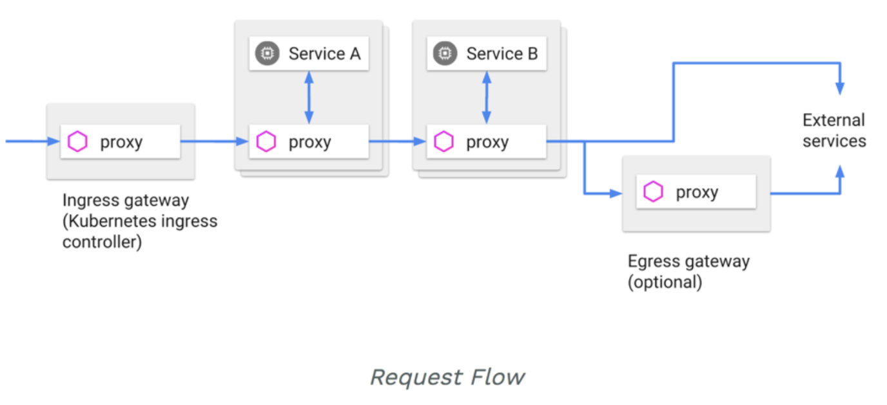

# Instalacion de Istio como Operador


El Repositorio incluye ejemplos de recursos personalizados en openshift-ansible/istio:

* istio-installation-minimal.yaml: Minimal Red Hat OpenShift service mesh installation
* istio-installation-kiali.yaml: Basic Red Hat OpenShift service mesh installation, including Kiali
* istio-installation-full.yaml: Full Red Hat OpenShift service mesh installation, all features enabled

Examples must be customized before deployment

1. Clonar el proyecto:
```
git clone https://github.com/Maistra/openshift-ansible
```
2. Crear un nuevo proyecto istio-operator:
```
oc new-project istio-operator --display-name="Service Mesh Operator"
```
3. Crear el operator:
```
oc process -f $HOME/openshift-ansible/istio/istio_product_operator_template.yaml --param=OPENSHIFT_ISTIO_MASTER_PUBLIC_URL=$(oc whoami --show-server) | oc create -f -
```


# Traffic Management

Red Hat® OpenShift® service mesh traffic management desacompla el decouples traffic flow and infrastructure scaling

+ Use Pilot para especificar reglas para la gestión del tráfico entre pods
+ Pilot y Envoy gestionan qué pods reciben tráfico
+ Ejemplo: El Service A llama al Service B

+ Use Pilot para especificar que desea:
  + 95% del tráfico enrutado al Service B, pods 1–3
  + 5% del tráfico enrutado al Service B, pod 4


# Componentes de Service Mesh
## Pilot

* Administra y configura instancias de proxy Envoy (sidecar) en la malla de servicio
* Le permite especificar reglas de enrutamiento para usar entre servicios en la malla de servicios
* Permite el descubrimiento de servicios, actualizaciones dinámicas para el balanceador de carga, tablas de enrutamiento

## Envoy
Cada instancia de proxy de Envoy obtiene y mantiene información de configuración de Pilot


## Mixer

# Solicitudes de enrutamiento
## Comunicación entre servicios
+ Los clientes de servicio no tienen conocimiento de las diferentes versiones de servicio.
+ Los clientes acceden a los servicios utilizando el hostname del servicio o IP
+ Envoy proxy/sidecar intercepta, reenvia solicitudes/respuestas entre el cliente y el servicio
+ Envoy determina el servicio para usar dinámicamente en función de las reglas de enrutamiento configuradas con Pilot
+ Las reglas de enrutamiento permiten a Envoy seleccionar la versión en función de las condiciones, como:
   + Headers
   + Tags associados con fuente/destino
   + Pesos asignados a cada versión

## Ingress and Egress
+ En Red Hat OpenShift service mesh, el tráfico que ingresa y sale de la malla del servicio transita a través de servidores proxy Envoy
+ Tener un proxy Envoy frente a los servicios le permite realizar pruebas A/B, implementar despliegues canary, etc.
+ Para acceder a servicios externos, agregue funciones de recuperación de fallas (failure-recovery): tiempos de espera (timeouts), reintentos (retries), etc.




