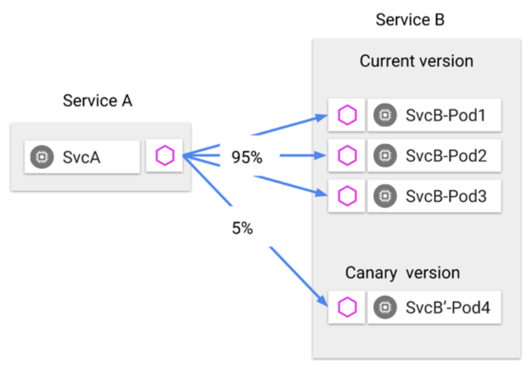
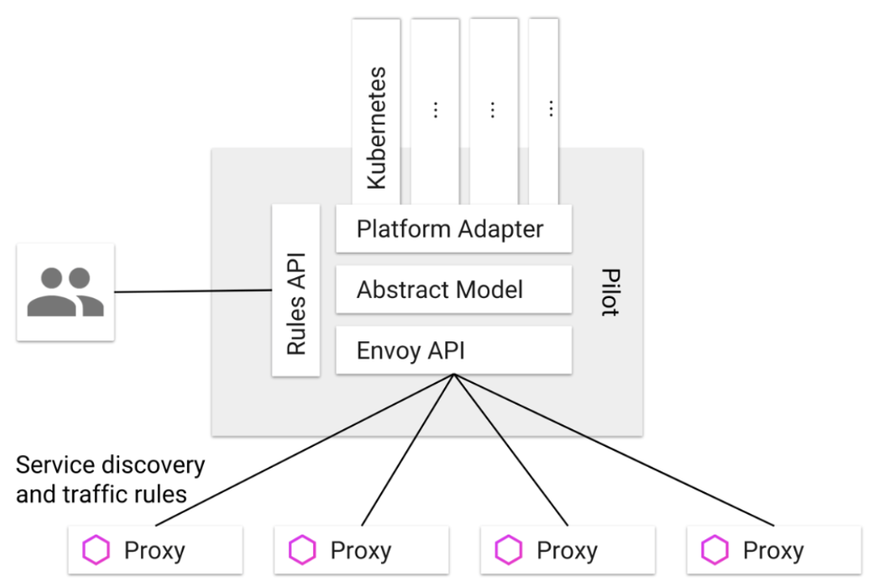

# Instalacion de Istio como Operador


Repository includes example custom resources in openshift-ansible/istio:

istio-installation-minimal.yaml: Minimal Red Hat OpenShift service mesh installation
istio-installation-kiali.yaml: Basic Red Hat OpenShift service mesh installation, including Kiali
istio-installation-full.yaml: Full Red Hat OpenShift service mesh installation, all features enabled

Examples must be customized before deployment

1. Clonar el proyecto:
```
git clone https://github.com/Maistra/openshift-ansible
```
2. Crear un nuevo proyecto istio-operator:
```
oc new-project istio-operator --display-name="Service Mesh Operator"
```
3. Crear el operator:
```
oc process -f $HOME/openshift-ansible/istio/istio_product_operator_template.yaml --param=OPENSHIFT_ISTIO_MASTER_PUBLIC_URL=$(oc whoami --show-server) | oc create -f -
```


# Traffic Management

Red Hat® OpenShift® service mesh traffic management decouples traffic flow and infrastructure scaling

Use Pilot to specify rules for traffic management between pods

Pilot and Envoy manage which pods receive traffic

Example: Service A calls Service B

Use Pilot to specify that you want:

95% of traffic routed to Service B, pods 1–3

5% of traffic routed to Service B, pod 4




# Componentes de Service Mesh
* Pilot
- Manages and configures Envoy proxy (sidecar) instances in service mesh
- Allows you to specify routing rules to use between services in service mesh
- Enables service discovery, dynamic updates for load balancing, routing tables

* Envoy
- Each Envoy proxy instance gets and maintains configuration information from Pilot



* Mixer

# Request Routing
Communication Between Services
- Los clientes de servicio no tienen conocimiento de las diferentes versiones de servicio.
- Los clientes acceden a los servicios utilizando el hostname del servicio o IP
- Envoy proxy/sidecar intercepta, reenvia solicitudes/respuestas entre el cliente y el servicio
- Envoy determina el servicio para usar dinámicamente en función de las reglas de enrutamiento configuradas con Pilot
- Las reglas de enrutamiento permiten a Envoy seleccionar la versión en función de las condiciones, como:
**Headers
**Tags associados con fuente/destino
**Pesos asignados a cada versión
