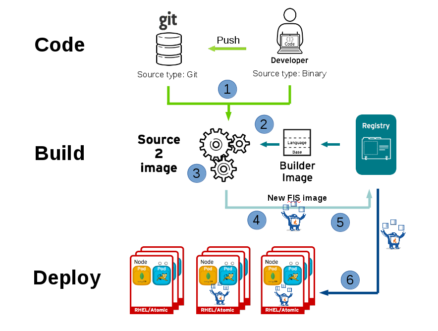

# Acceso Cluster OpenShift Workshop Despliegue de aplicaciones en OpenShift

## Imagen de referencia





## Antes de iniciar
Antes de iniciar, tenga en cuenta que a este workshop ingresaran varias personas, por lo que previo a esto es necesario que cada uno seleccione un numero de usuario y con este trabajara durante todos los talleres
Ejemplo:

* user01 - Jose Manuel 
* user02 - German Pulido
* user03 - Camilo Astros
* user04 - Camilo Mendez

y asi sucesivamente, una vez tenga SU usuario, durante los talleres reemplaze userXX por user04 (o su usuario asignado)

Las contraseñas de los usuarios tanto por SSH como por consola seran redhat01

## Por Navegador
```
https://loadbalancer.2775.example.opentlc.com/
```

## Acceso por SSH a la maquina Bastion
```
ssh user0X@bastion.2775.example.opentlc.com
oc login https://loadbalancer.2775.internal:443 -u user0X -p redhat01
```


## Facilitador / Consultor Red Hat
Jose Manuel Calvo I


# Laboratorios
[Taller 1](talleresd/taller1.md) - Despliegue de aplicaciones desde Docker y s2i

[Taller 2](talleresd/taller2.md) - Uso de repositorios GIT

[Taller 3](talleresd/taller3.md) - Estrategias de despliegues en OpenShift

[Taller 4](talleresd/taller4.md) - Configuracion de Rutas

[Taller 5](talleresd/taller5.md) - Configuracion de limites y quotas en los pods


