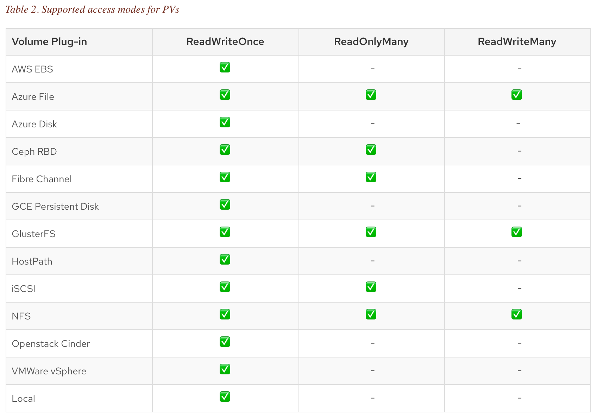
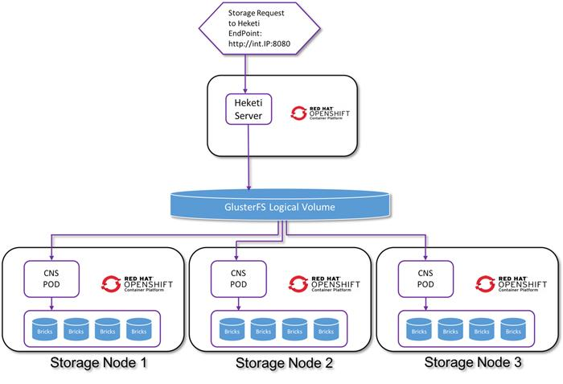

# Talleres
[Inicio](../Inicio.md)


# A traves de Volumenes persistentes:
Los PVC pueden ser de 3 tipos:


| MODO   |      ABREVIATURA      |  DESCRIPCION |
|----------|:-------------:|------:|
| ReadWriteOnce |  RWO | The volume can be mounted as read-write by a single node. |
| ReadOnlyMany |    ROX   |   The volume can be mounted read-only by many nodes. |
| ReadWriteMany | RWX |    The volume can be mounted as read-write by many nodes. |



### PVC - Persistent Volume Claims

Los PVC son específicos de un proyecto y son creados y utilizados por los desarrolladores como un medio para usar un PV. Los recursos PV por sí solos no están sujetos a un solo proyecto; se pueden compartir en todo el clúster de OpenShift Enterprise y reclamar desde cualquier proyecto. Sin embargo, después de que un PV se ha unido a un PVC, ese PV no se puede unir a PVC adicionales.

### PV - Persistent Volume
Los PV se definen mediante un objeto API PersistentVolume, que representa una parte del almacenamiento en red existente en el clúster que ha sido aprovisionado por un administrador. Es un recurso en el clúster al igual que un nodo es un recurso de clúster. Los objetos PV capturan los detalles de la implementación del almacenamiento, ya sea NFS, iSCSI o un sistema de almacenamiento específico del proveedor de la nube como por ejemplo OCS (OpenShift Container Storage)

### OpenShift Container Storage
OpenShift Container Storage adiciona un componente adicional, gracias a este componente, las aplicaciones solicitan un PVC a Heketi a traves de un servicio REST y heketi se encarga de crear un PV a nivel del servicio de Gluster.



# Taller No 2.
Taller de datos persistentes para las aplicaciones utilizando NFS

# Adicionar Volumenn a un pod existente

1. Cree un archivo llamado data01.yml y defina el tipo de almacenamiento 
```
[user01@bastion ~]$ cat << EOF > data01.yml
apiVersion: v1
kind: PersistentVolumeClaim
metadata:
  name: data01
spec:
  accessModes:
  - ReadWriteOnce
  resources:
    requests:
      storage: 5Gi
EOF

```
Verifique el archivo creado
```
[user01@bastion ~]$ cat data01.yml
...
...
```
2. Verifique los Persistent Volume Claim (PVC) creados previamente
```
[user01@bastion ~]$ oc get pvc
NAME      STATUS    VOLUME    CAPACITY   ACCESS MODES   STORAGECLASS   AGE
```
3. Cree el nuevo PVC y verifiquelo
```
[user01@bastion ~]$ oc create -f data01.yml
persistentvolumeclaim/data01 created

[user01@bastion ~]$ oc get pvc
NAME      STATUS    VOLUME    CAPACITY   ACCESS MODES   STORAGECLASS   AGE
data01    Bound     pv7       5Gi        RWO                           2s
```

4. Montar el nuevo PVC sobre un contenedor existente
Asegurese que tenga aplicaciones previamente creadas, en caso de que no, cree una
```
[user01@bastion ~]$ oc new-app php~https://github.com/jmanuelcalvo/app.git --name=app2
[user01@bastion ~]$ oc set volume dc/app2 --add --type=persistentVolumeClaim --claim-name=data01 --mount-path=/data2
```

5. Verificar que el nuevo pod tenga la carpeta montada
```diff
[user01@bastion ~]$ oc get pod
NAME           READY     STATUS      RESTARTS   AGE
app2-1-build   0/1       Completed   0          4h
app2-7-pm5vk   1/1       Running     0          2m

[user01@bastion ~]$ oc rsh  app2-7-pm5vk
sh-4.2$ df -h
Filesystem                                      Size  Used Avail Use% Mounted on
overlay                                          50G  7.5G   43G  15% /
tmpfs                                           3.9G     0  3.9G   0% /dev
tmpfs                                           3.9G     0  3.9G   0% /sys/fs/cgroup
- support1.1b84.internal:/srv/nfs/user-vols/pv7   197G  4.6G  183G   3% /data2
/dev/xvda2                                       50G  7.5G   43G  15% /etc/hosts
shm                                              64M     0   64M   0% /dev/shm
tmpfs                                           3.9G   16K  3.9G   1% /run/secrets/kubernetes.io/serviceaccount
tmpfs                                           3.9G     0  3.9G   0% /proc/acpi
tmpfs                                           3.9G     0  3.9G   0% /proc/scsi
tmpfs                                           3.9G     0  3.9G   0% /sys/firmware
```

# Adicionar Volumenn a una aplicacion nueva

1. Cree un archivo llamado data01.yml y defina el tipo de almacenamiento 
```
[user01@bastion ~]$ cat << EOF > data02.yml
apiVersion: v1
kind: PersistentVolumeClaim
metadata:
  name: data02
spec:
  accessModes:
  - ReadWriteOnce
  resources:
    requests:
      storage: 5Gi
EOF

```
Verifique el archivo creado
```
[user01@bastion ~]$ cat data02.yml
...
...
```
2. Verifique los Persistent Volume Claim (PVC) creados previamente
```
[user01@bastion ~]$ oc get pvc
NAME      STATUS    VOLUME    CAPACITY   ACCESS MODES   STORAGECLASS   AGE
data01    Bound     pv7       5Gi        RWO                           24m
```
3. Cree el nuevo PVC y verifiquelo
```
[user01@bastion ~]$ oc create -f data02.yml
persistentvolumeclaim/data02 created

[user01@bastion ~]$ oc get pvc
NAME      STATUS    VOLUME    CAPACITY   ACCESS MODES   STORAGECLASS   AGE
data01    Bound     pv7       5Gi        RWO                           25m
data02    Bound     pv9       5Gi        RWO                           6s
```

4. Cree un archivo en formato yaml con las siguientes definiciones y presete especial atencion a los parametros que inician por volume
```
[user01@bastion ~]$ cat << EOF > mysql.yml
apiVersion: v1
kind: Service
metadata:
  name: mysql
spec:
  ports:
  - port: 3306
  selector:
    app: mysql
  clusterIP: None
---
apiVersion: apps/v1
kind: Deployment
metadata:
  name: mysql
spec:
  selector:
    matchLabels:
      app: mysql
  strategy:
    type: Recreate
  template:
    metadata:
      labels:
        app: mysql
    spec:
      containers:
      - image: mysql:5.6
        name: mysql
        env:
          # Use secret in real usage
        - name: MYSQL_ROOT_PASSWORD
          value: password
        ports:
        - containerPort: 3306
          name: mysql
        volumeMounts:
        - name: mysql-persistent-storage
          mountPath: /var/lib/mysql
      volumes:
      - name: mysql-persistent-storage
        persistentVolumeClaim:
          claimName: data02
EOF
```
Verfique el archivo creado
```
[user01@bastion ~]$ cat mysql.yml
...
...
```
5. Cree la aplicacion y el servicio a partir del nuevo archivo
```
[user01@bastion ~]$ oc create -f  mysql.yml
service/mysql created
deployment.apps/mysql created
```
6. Verifique que la aplicacion esta corriendo y que tiene el volumen persistente
```diff
[user01@bastion ~]$ oc get pod
  NAME                     READY     STATUS      RESTARTS   AGE
  app2-1-build             0/1       Completed   0          5h
  app2-7-pm5vk             1/1       Running     0          25m
- mysql-685958c648-zftrv   1/1       Running     0          48s

[user01@bastion ~]$ oc rsh mysql-685958c648-zftrv
$ df -h
  Filesystem                                     Size  Used Avail Use% Mounted on
  overlay                                         50G  7.9G   43G  16% /
  tmpfs                                          3.9G     0  3.9G   0% /dev
  tmpfs                                          3.9G     0  3.9G   0% /sys/fs/cgroup
  /dev/xvda2                                      50G  7.9G   43G  16% /etc/hosts
  shm                                             64M     0   64M   0% /dev/shm
- support1.1b84.internal:/srv/nfs/user-vols/pv9  197G  4.6G  183G   3% /var/lib/mysql
  tmpfs                                          3.9G   16K  3.9G   1% /run/secrets/kubernetes.io/serviceaccount
  tmpfs                                          3.9G     0  3.9G   0% /proc/acpi
  tmpfs                                          3.9G     0  3.9G   0% /proc/scsi
  tmpfs                                          3.9G     0  3.9G   0% /sys/firmware
```
7. Cree una Base de datos
```diff
$ mysql -u root -ppassword
Warning: Using a password on the command line interface can be insecure.
Welcome to the MySQL monitor.  Commands end with ; or \g.
Your MySQL connection id is 3
Server version: 5.6.46 MySQL Community Server (GPL)

Copyright (c) 2000, 2019, Oracle and/or its affiliates. All rights reserved.

Oracle is a registered trademark of Oracle Corporation and/or its
affiliates. Other names may be trademarks of their respective
owners.

Type 'help;' or '\h' for help. Type '\c' to clear the current input statement.


+ mysql> create database sample;
Query OK, 1 row affected (0.00 sec)

+ mysql> show databases;
+--------------------+
| Database           |
+--------------------+
| information_schema |
| mysql              |
| performance_schema |
| sample             |
+--------------------+
4 rows in set (0.01 sec)

+ mysql> exit
Bye
$ exit

```
8. Verifique que los datos persisten
```
[user01@bastion ~]$ oc get pod
NAME                     READY     STATUS      RESTARTS   AGE
app2-1-build             0/1       Completed   0          5h
app2-7-pm5vk             1/1       Running     0          30m
mysql-685958c648-g7z2m   1/1       Running     0          14s

[user01@bastion ~]$ oc rsh mysql-685958c648-g7z2m
$ mysql -u root -ppassword
Warning: Using a password on the command line interface can be insecure.
Welcome to the MySQL monitor.  Commands end with ; or \g.
Your MySQL connection id is 1
Server version: 5.6.46 MySQL Community Server (GPL)

Copyright (c) 2000, 2019, Oracle and/or its affiliates. All rights reserved.

Oracle is a registered trademark of Oracle Corporation and/or its
affiliates. Other names may be trademarks of their respective
owners.

Type 'help;' or '\h' for help. Type '\c' to clear the current input statement.

mysql> show databases;
+--------------------+
| Database           |
+--------------------+
| information_schema |
| mysql              |
| performance_schema |
| sample             |
+--------------------+
4 rows in set (0.01 sec)
```


# A traves de ConfigMap:
Los configMaps son variables que se le inyectan a los contenedores de la siguiente forma:


1. Creacion del recurso configMap
```
[user01@bastion ~]$ oc create cm myconf --from-literal APP_MSG="Mensaje" --from-literal APP_HEADER="Titulo"
configmap/myconf created
[user01@bastion ~]$ oc set env dc/app2 --from configmap/myconf
deploymentconfig.apps.openshift.io/app2 updated
```
2. En caso que sea el primer configMap inyectado, OpenShift generara una nueva version, de lo contrario, si es una modificacion de un CM creado, se debe forzar a que se cree una nueva version la aplicacion basado en el deploymentconfig
```
[user01@bastion ~]$ oc rollout latest app2
deploymentconfig.apps.openshift.io/app2 rolled out
```

3. Validar el funcionamiento desde el web o con el comando cURL:
```diff
[user01@bastion ~]$ oc get route
  NAME      HOST/PORT                                             PATH      SERVICES   PORT       TERMINATION   WILDCARD
- app2      app2-jmanuel-project2.apps.1b84.example.opentlc.com             app2       8080-tcp                 None
```
NOTA: Recuerde poner el archivo var.php que es el codigo que lee las variables del sistema operativo

```diff
- [user01@bastion ~]$ curl  app2-jmanuel-project2.apps.1b84.example.opentlc.com/var.php
  <h4>Bienvenidos a: Titulo
  </h4><br><p>El valor del CM/APP_MSG es: Mensaje
  </p>
```


# A traves de Secret:
1. Creacion de una contraseña en formato base64
```
[user01@bastion ~]$ echo "password" |base64
cGFzc3dvcmQK
```

2. Creacion de un archivo que contenga los datos de secret, entre ellos la clave que acabamos de poner
```
[user01@bastion ~]$ cat << EOF > secret.yaml
apiVersion: v1
kind: Secret
metadata:
  name: database-secret
type: Opaque 1
data:
  username: cGFzc3dvcmQK
  password: cGFzc3dvcmQK
EOF 
 ```
 
 3. Creacion del secret a partir del archivo yaml
 ```
[user01@bastion ~]$ oc create -f secret.yaml
secret/database-secret created
```

4. Elimine todos las aplicaciones y cree una nueva base de datos que obtenta el password de este secret, preste atencion a los parametros secretKeyRef del archivo mysql-secret.yml
```
[user01@bastion ~]$ oc delete all --all
...
...

[user01@bastion ~]$ cat << EOF > mysql-secret.yml
apiVersion: v1
kind: Service
metadata:
  name: mysql
spec:
  ports:
  - port: 3306
  selector:
    app: mysql
  clusterIP: None
---
apiVersion: apps/v1
kind: Deployment
metadata:
  name: mysql
spec:
  selector:
    matchLabels:
      app: mysql
  strategy:
    type: Recreate
  template:
    metadata:
      labels:
        app: mysql
    spec:
      containers:
      - image: mysql:5.6
        name: mysql
        env:
        - name: MYSQL_ROOT_PASSWORD
          valueFrom:
            secretKeyRef:
              name: database-secret
              key: password
        ports:
        - containerPort: 3306
          name: mysql
        volumeMounts:
        - name: mysql-persistent-storage
          mountPath: /var/lib/mysql
      volumes:
      - name: mysql-persistent-storage
        persistentVolumeClaim:
          claimName: data02
EOF
```

5. Realizar las pruebas de conexion a la base de datos realizadas en las practicas pasadas
