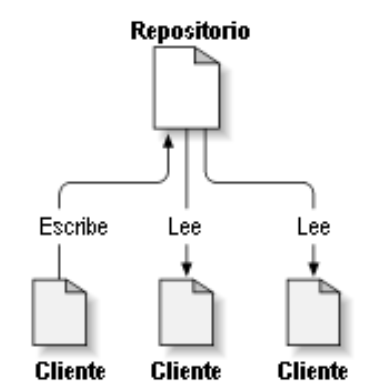
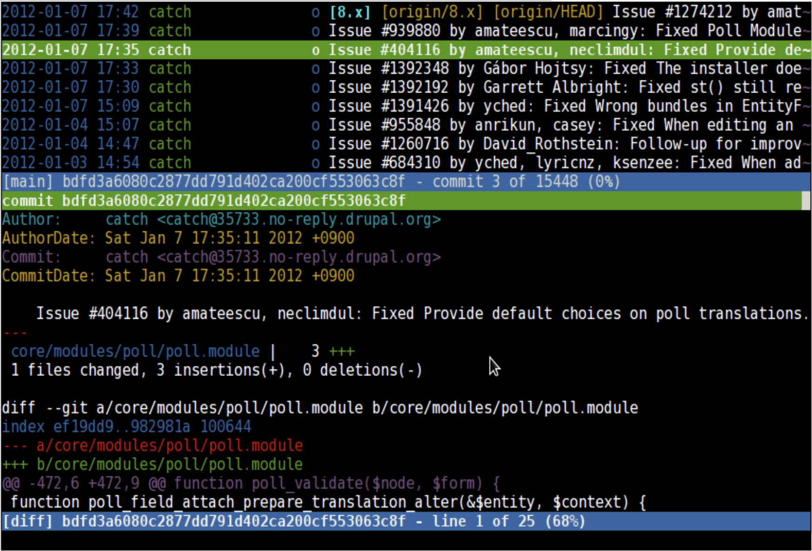

# Uso basico de la herramitna GIT


# Conceptos básicos de control de versiones
## Repositorio
Usa una base de datos central que contiene todos los archivos cuyas versiones se controlan y sus respectivas historias El repositorio normalmente esta en un servidor de archivos

## Copia de trabajo
Cada colaborador tiene su propia copia de trabajo en su computador local. Usted puede obtener la última versión del repositorio, trabajar en ella localmente sin perjudicar a nadie, y cuando esté feliz con los cambios que ha realizado puede confirmar sus cambios en el repositorio.



El repositorio almacena información en forma de un árbol de archivos, Un número de clientes se conectan al repositorio, y luego leen o escriben esos archivos.
Al escribir datos, el cliente hace que la información esté disponible para los otros; al leer los datos, el cliente recibe información de los demás.
Lo que hace al repositorio de especial es que recuerda todos los cambios que alguna vez se hayan escrito en él: cada cambio en cada archivo, e incluso los cambios en el propio árbol de directorios, como el añadir, borrar o reorganizar archivos y directorios.


# Iniciar basico con GIT
Una vez creado el repositiorio en su servidor de repositiorios este puede ser inicializado desde la consola web o desde la terminal de comandos asi:

* Consola Web


* Terminal de comandos
En caso de querer realizar esta actividad por la terminal se deben seguir estos pasos:
```
[server@bastion ~]$ mkdir proyecto01
[server@bastion ~]$ cd proyecto01/
[server@bastion ~]$ touch README.md
[server@bastion ~]$ git init
Initialized empty Git repository in /home/jcalvo-redhat.com/abc/.git/
[server@bastion ~]$ git add README.md
[server@bastion ~]$ git commit -m "first commit"
[master (root-commit) d19a75e] first commit
 1 file changed, 0 insertions(+), 0 deletions(-)
 create mode 100644 README.md
[server@bastion ~]$ git remote add origin http://gogs.apps.2775.example.opentlc.com/jmanuel/proyecto01.git
[server@bastion ~]$ git push -u origin master
Username for 'http://gogs.apps.2775.example.opentlc.com': jmanuel
Password for 'http://jmanuel@gogs.apps.2775.example.opentlc.com':
Counting objects: 3, done.
Writing objects: 100% (3/3), 217 bytes | 0 bytes/s, done.
Total 3 (delta 0), reused 0 (delta 0)
To http://gogs.apps.2775.example.opentlc.com/jmanuel/proyecto01.git
 * [new branch]      master -> master
Branch master set up to track remote branch master from origin.
```

# Comandos basicos
Una vez adicione un archivo en su carpeta local o realice el cambios recuerde que estos cambios en principio se encuentran en su carpeta local

git diff - permite visualizar las diferencias entre los archivos desde cuando descargo su ultima copia y las modificaciones que ha realizado
```
[server@bastion proyecto1]$ git diff 
```

git add - Adiciona un archivo o varios al contenido de su copia local

```
[server@bastion proyecto1]$ git add Archivo

En caso de contar con muchos nuevos archivos puede usar el caracter . este carga todos los archivos nuevos y modificados

[server@bastion proyecto1]$ git add .
```

git commit - Permite adicionar una descripcion de las modificaciones de esta version
```
[server@bastion proyecto1]$ git commit

Ingresa a una terminal con el editor VIM donde puede adicionar los comentarios de la version

[jcalvo-redhat.com@bastion abc]$ git commit -m "Descripcion de la version que estaba modificando"

Ingresa la descripcion desde el comando
```

git log - Permite visualizar las diferentes versiones del proyecto
```
[server@bastion proyecto1]$ git log
```

git checkout version - Para volver a una version anterior de todo nuestro directorio de trabajo
```
[server@bastion proyecto1]$ git checkout d19a75ef658aaea3d14f9e3c8856946d72ca19c9 
o puede unicamente recuerar un archivo de una version especifica

[server@bastion proyecto1]$ git checkout version -- archivo
```

git push - Permite sincronizar nuestra copia local con la que esta en el servidor visible por todos los usuarios
```
[server@bastion proyecto1]$ git push
[jcalvo-redhat.com@bastion abc]$ git push
Username for 'http://gogs.apps.2775.example.opentlc.com': jmanuel
Password for 'http://jmanuel@gogs.apps.2775.example.opentlc.com':
Counting objects: 6, done.
Delta compression using up to 4 threads.
Compressing objects: 100% (3/3), done.
Writing objects: 100% (4/4), 381 bytes | 0 bytes/s, done.
Total 4 (delta 0), reused 0 (delta 0)
To http://gogs.apps.2775.example.opentlc.com/jmanuel/proyecto01.git
   d19a75e..69f1276  master -> master

```


# Modelos de versionado
Todos los sistemas de control de versiones tiene que resolver los mismos problemas fundamentales: ¿cómo permitirá el sistema compartir información entre usuarios, pero evitando que ellos accidentalmente se pisen uno a otros? Es demasiado sencillo que los usuarios accidentalmente sobreescriban los cambios del otro en el repositorio.

# Nota Importante

Una vez este trabajando en el git colabortivo, recuerde antes de iniciar la edicion de un archivo realizar estos pasos:

1. Para actualizar su repositorio local al commit más reciente, ejecute:
```
git pull
```

2. Edite los archivos o cree los nuevos y ejecute el commando ADD para inidicar que hay un archivo nuevo o cambiado
```
git add .
```

3. Adicione los comentarios pertinentes relacionados con el cambio que realizo
```
git commit -m "Se realizaron cambios en el README"
```

4. Publique los cambios en el servidor git
```
git push
```

Una herramienta muy útil para examinar el log de un proyecto es tig, esta nos permite visualizar de forma estructurada los últimos commits permitiendo una navegación cómoda.
```
tig
```
En caso que no este instalada se puede descargar en RHEL7 asi:
```
yum install http://download-ib01.fedoraproject.org/pub/epel/7/x86_64/Packages/t/tig-2.4.0-1.el7.x86_64.rpm
```



## Trabajo con RAMAS / BRANCH
https://desarrolloweb.com/articulos/trabajar-ramas-git.html

## Informacion adicional de git
https://github.com/INMEGEN/taller.supercomputo/blob/master/presentaciones/git.md

